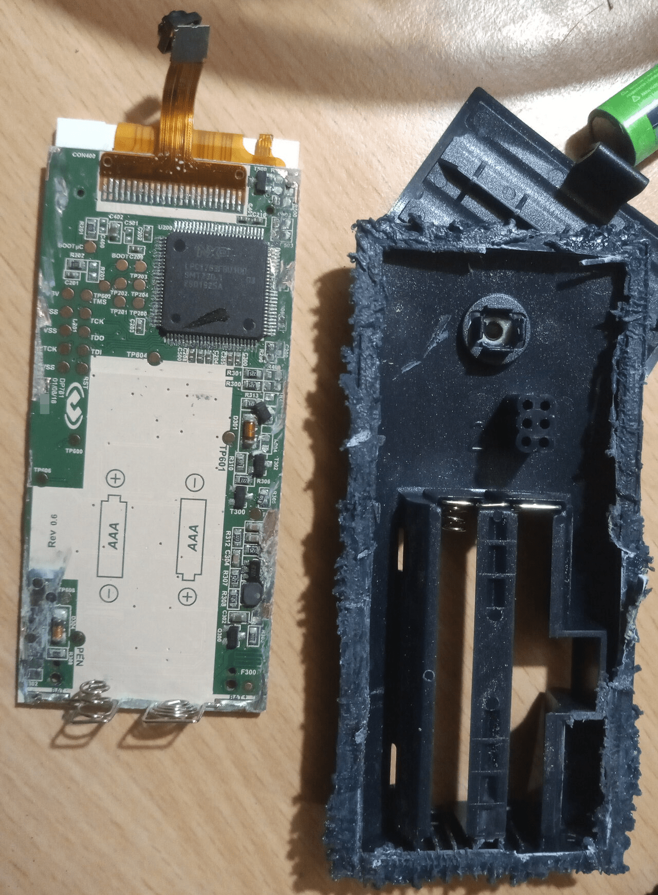
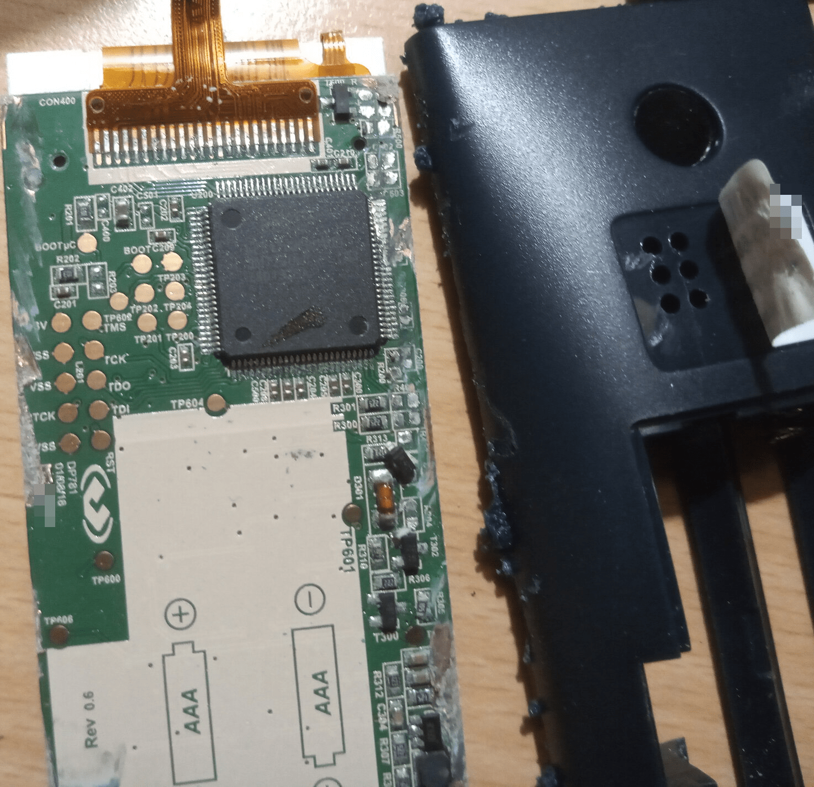
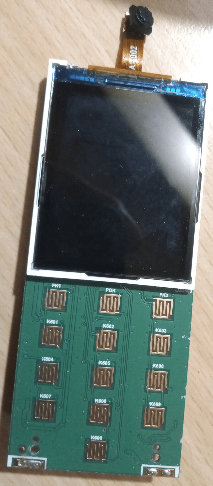
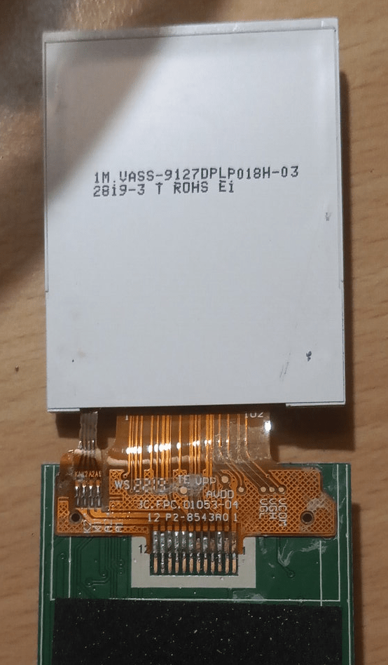

# Digipass 770

This is a physical authenticator used by some banks to authentify the user.

The device has a keypad used to input a 4-digit PIN code, a low resolution camera, a color screen, and 2 AAA batteries.

It is designed to scan Cronto codes (some kind of color QR code) and output OTP codes (8 digits).

I has a real time clock, but no way to keep time, so the time is probably transmitted through the Cronto code.

## Resources

- [Digipass 770 datasheet](https://www.onespan.com/resources/digipass-770/datasheet)
- [Cronto Visual Transaction Signing](https://www.onespan.com/products/transaction-signing/cronto)
- https://security.stackexchange.com/questions/215468/how-does-the-phototan-cronto-visual-transaction-signing-procedure-work
- [Decoding Algorithm for color QR code: A Mobile Scanner Application Nivedan Bhardwaj, et al.](https://www.researchgate.net/publication/309041301_Decoding_algorithm_for_color_QR_code_A_mobile_scanner_application)
- [Robust and Fast Decoding of High-Capacity Color QR Codes for Mobile Applications Zhibo Yang, et al.](https://arxiv.org/pdf/1704.06447.pdf)

## Activation

1. The bank sends both the device and an activation letter to the user, the letter contains a Cronto code.
2. When the user logs in for the first time, they have to scan the activation code, 

It has an internal real time clock.

## Opening

The case seems to be glued together, and can only be opened by destroying the case.

But peeling off the sticker gives access to 6 test points: BOOT, C209, TP202, TP203, TP201, TP200.

## Internals

These photos come from a destructive opening that damaged components on the sides.

The device is based on an NXP LPC1763FBD100 package: https://www.nxp.com/products/LPC1763FBD100

